# Book Shop

## Project "Book Shop" is a web application for an online book store, developed using ASP.NET Core MVC, Entity Framework Core, and Stripe for payment processing. The main goal of the project is to provide a convenient interface for visitors to browse detailed information about available books, register, and make purchases.

----

# Key features and characteristics of the project:

## 1. User Registration:

The application provides functionality for user registration. Visitors can create accounts by providing their details such as name, email, and password.

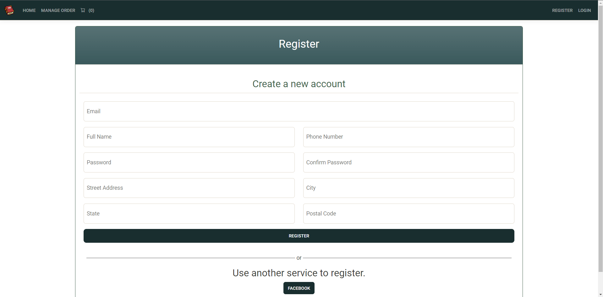

## 2. Account Management:

Users can update their profile information, including name, address, and other personal details. They also have the option to change their password or recover it in case of loss.

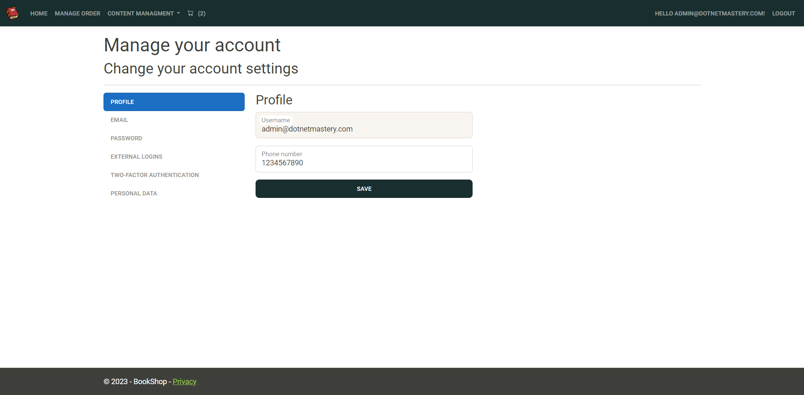

## 3. Facebook Authorization:

In addition to standard registration, the project also offers the option to log in using Facebook accounts. This allows users to quickly sign in to the website using their Facebook credentials without the need to create a separate account.

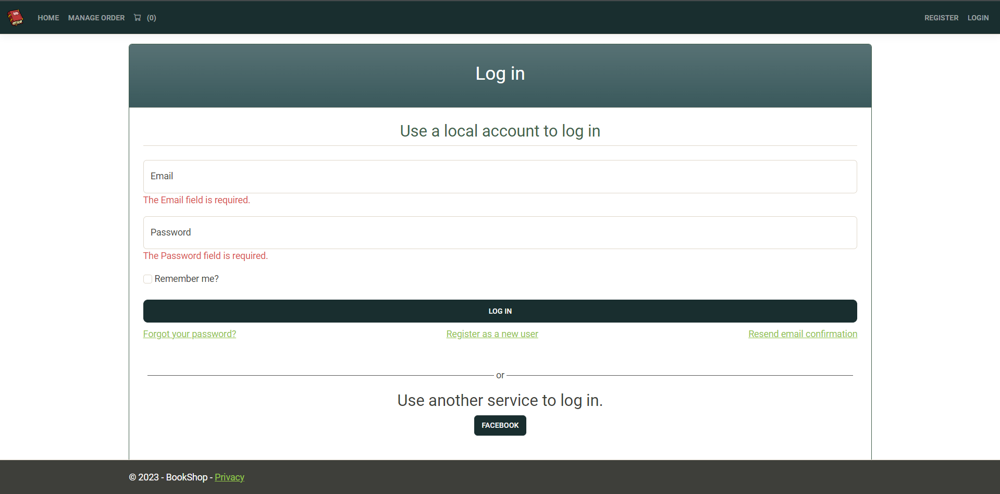

## 4. Viewing Detailed Book Information:

Registered users can view detailed information about each book, including its cover, description, rating, and reviews from other users.

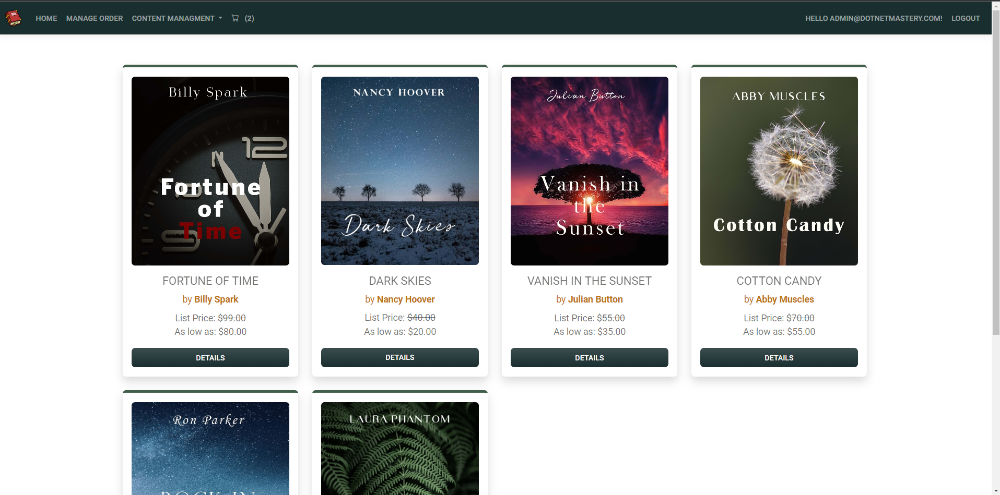

##

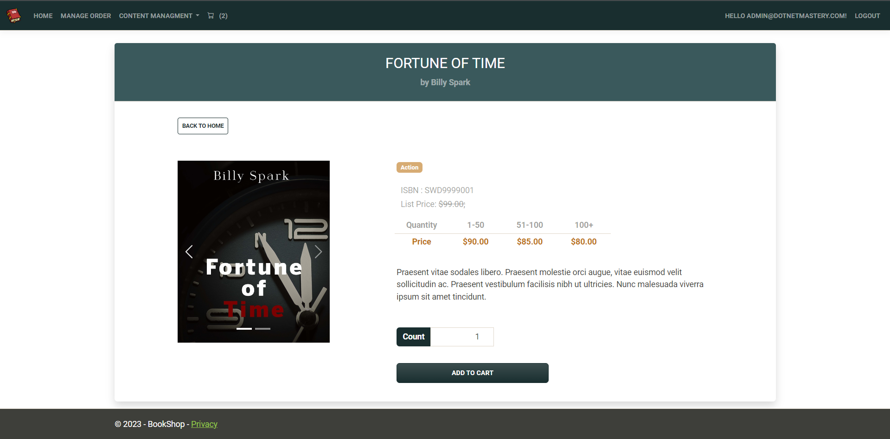

## 5. Shopping Cart and Checkout:

After selecting books, users can add them to their shopping cart. They can then review the contents of their cart, adjust the quantities of books, or remove books before proceeding to checkout. The integrated Stripe payment service is used for order payments, enabling users to securely and conveniently pay for their orders using various payment methods.

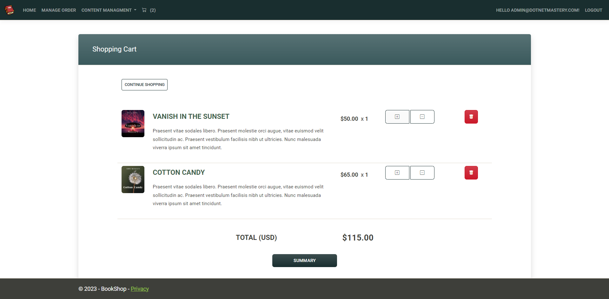

##

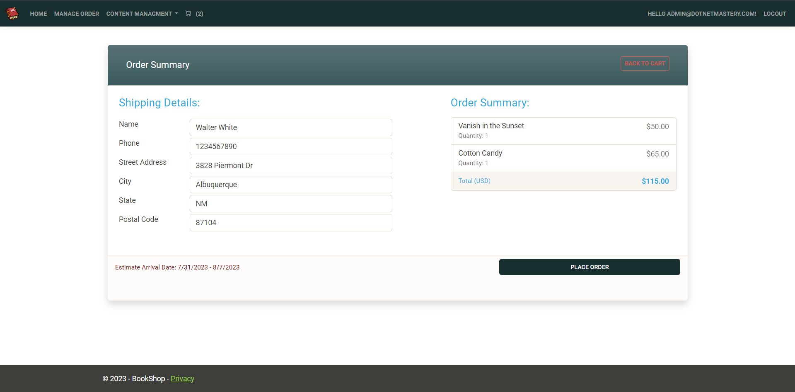

##

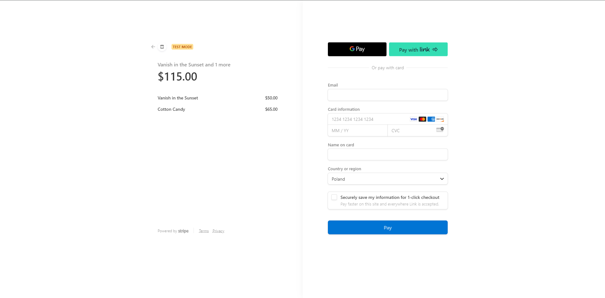

## 6. Order History:

Registered users have access to their order history, allowing them to track delivery statuses and review previous purchases.

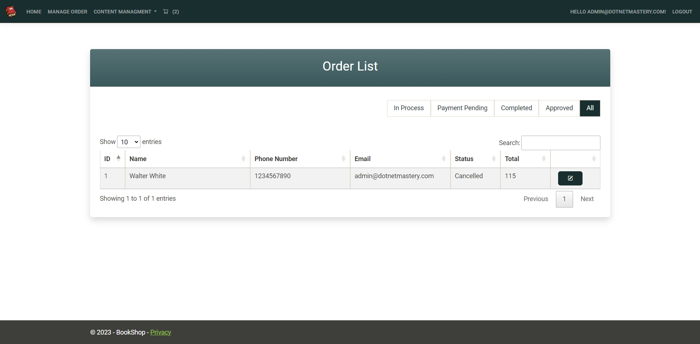

## 7. Administrative Section:

The project includes an administrative section accessible only to administrators. Here, administrators can manage the book catalog, user reviews, orders, and user accounts.

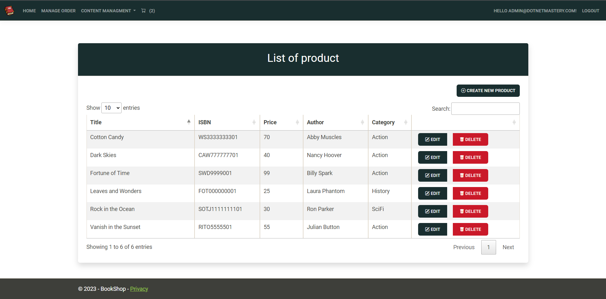

##

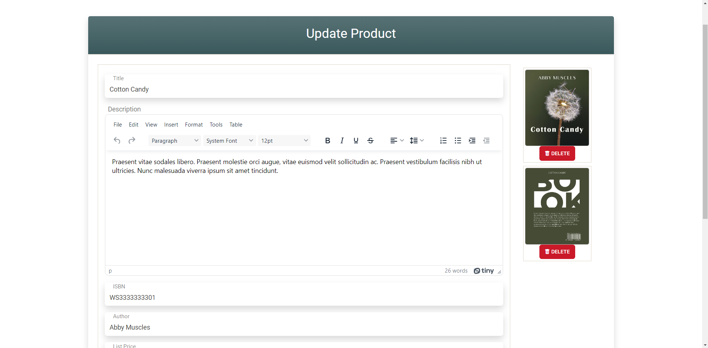

##

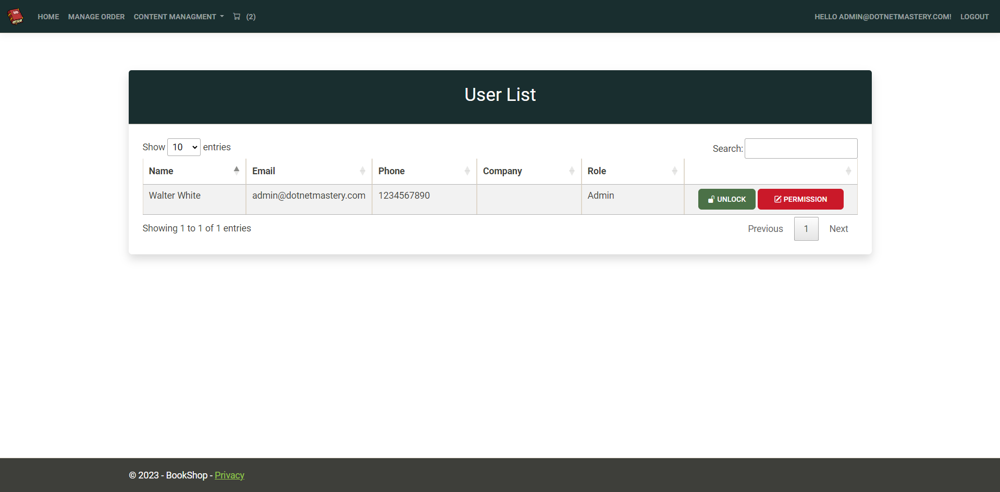

---

## "Book Shop" represents a full-fledged web application for purchasing books online with a user-friendly interface, user registration support, and integration with the Stripe payment system for payment processing.

---

## License

>You can check out the full license [here](https://github.com/ymatko/book-shop/blob/main/LICENSE.txt).

This project is licensed under the terms of the MIT license.